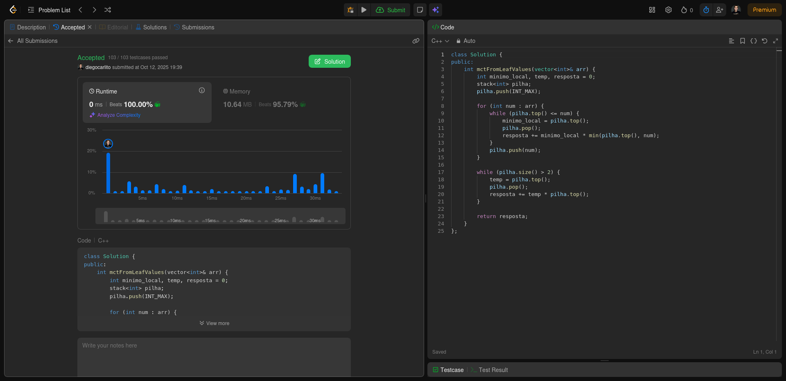

# Greed_LeetCode-D17

**Número da Lista**: 3 
**Conteúdo da Disciplina**: Algoritmos Ambiciosos 

## Alunos
|Matrícula | Aluno |
| -- | -- |
| 22/1007690  |  Diego Carlito Rodrigues de Souza  |
| 22/1008300  |  Marcos Antonio Teles de Castilhos |

## Sobre 
O projeto possui como tema central a resolução de exercícios de programação competitiva com o tema de Grafos, utilizando a plataforma de juiz online LeetCode.

## Exercícios

| Exercício | Nível  | Vídeo Explicando |
|---------|--------|------------------|
| [1130. Minimum Cost Tree From Leaf Values](https://leetcode.com/problems/minimum-cost-tree-from-leaf-values/description/) | Médio |  |
| [1235. Maximum Profit in Job Scheduling](https://leetcode.com/problems/maximum-profit-in-job-scheduling/description/) | Difícil |  |

[Vídeo explicando todos os exercícios]()

## Screenshots

### Exercício 01 - [1130. Minimum Cost Tree From Leaf Values](https://github.com/projeto-de-algoritmos-2025/Greed_LeetCode-D17/blob/master/1130_Minimum_Cost_Tree_From_Leaf_Values/solution.cpp) - Médio

  
   
  <a href="https://leetcode.com/problems/minimum-cost-tree-from-leaf-values/submissions/1799779651/">
    Visualizar submissão do exercício 1130
  </a>

### Exercício 02

<!--

  
   
  <a href="">
    Visualizar submissão do exercício ---
  </a>

-->

### Exercício 03

<!--

  
   
  <a href="">
    Visualizar submissão do exercício ---
  </a>

-->

### Exercício 04

<!--

  
   
  <a href="">
    Visualizar submissão do exercício ---
  </a>

-->

## Instalação 
**Linguagem**: C++ 

## Verificação

Para validar se a solução implementada está correta, submeta o código no **[LeetCode](https://leetcode.com/)** e verifique se o exercício foi aceito. Cada solução contém o link para a descrição completa do problema no próprio código-fonte.
